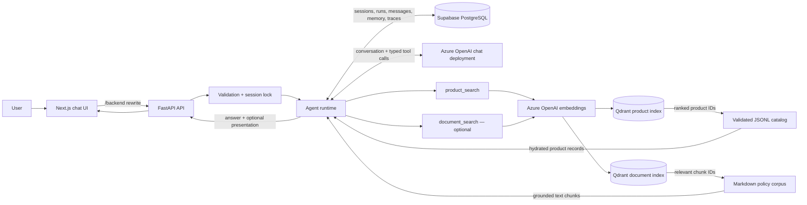
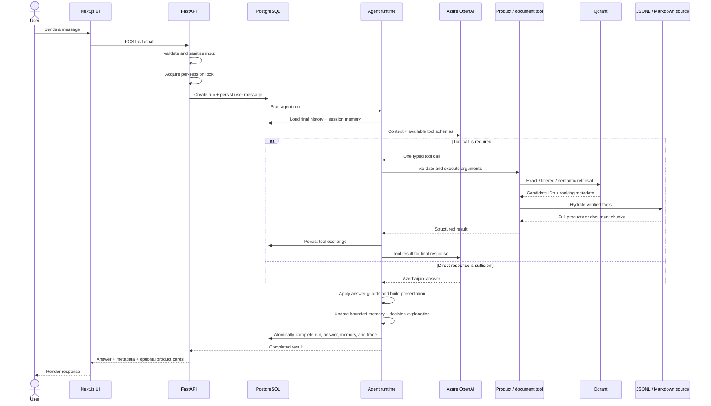

# Sales Bot

> A production-oriented Azerbaijani e-commerce assistant for conversational product discovery, grounded recommendations, policy Q&A, and persistent shopping sessions.

Sales Bot is a full-stack AI application built around a simple rule: the language model interprets the conversation, but product and policy facts must come from verified data sources.

The Next.js client provides the chat experience, FastAPI coordinates the agent loop, Azure OpenAI handles conversation and embeddings, Qdrant performs semantic retrieval, a validated JSONL catalog supplies complete product data, and Supabase PostgreSQL persists sessions, messages, tool activity, memory, and diagnostics.

> [!IMPORTANT]
> The repository contains a deterministic synthetic catalog for development, testing, and evaluation. Product names are realistic, but prices, stock, specifications, and URLs are not production commerce data.

## Table of contents

- [What the project delivers](#what-the-project-delivers)
- [Architecture](#architecture)
- [How the system works](#how-the-system-works)
- [Product retrieval and ranking](#product-retrieval-and-ranking)
- [Session memory](#session-memory)
- [Document RAG](#document-rag)
- [Technology stack](#technology-stack)
- [Dataset](#dataset)
- [Getting started](#getting-started)
- [API reference](#api-reference)
- [Configuration](#configuration)
- [Observability and debug mode](#observability-and-debug-mode)
- [Testing and evaluation](#testing-and-evaluation)
- [Project structure](#project-structure)
- [Current scope](#current-scope)

## What the project delivers

- Azerbaijani-language conversational shopping assistance
- Product lookup, discovery, comparison, recommendation, and follow-up questions
- Semantic search across 300 products in six electronics categories
- Exact matching by product ID, SKU, and model before semantic retrieval
- Typed filters for category, brand, model family, color, price, stock, rating, and category-specific specifications
- Explicit handling of exact matches, filter conflicts, alternatives, ambiguity, and no-result cases
- Directional ranking for requests such as “the cheapest,” “the lightest,” or “the model with the best battery life”
- Structured product cards rendered by a responsive Next.js interface
- Optional Markdown RAG for delivery, credit, warranty, returns, installation, and other store policies
- Persistent sessions with bounded, versioned conversational memory
- Development-only traces for model rounds, semantic plans, retrieval candidates, ranking, memory transitions, and latency
- Unit, acceptance, integration, frontend, and live semantic evaluation workflows

## Architecture



### Source-of-truth boundaries

| Concern | Authoritative source | Responsibility |
| --- | --- | --- |
| Conversation and intent | Azure OpenAI chat model | Understands Azerbaijani requests and chooses the next action |
| Product candidate retrieval | Qdrant | Applies payload filters and returns ranked product IDs |
| Product facts | `data/catalog/products.jsonl` | Supplies the final price, stock, rating, warranty, description, and specifications |
| Store-policy facts | Markdown files in `data/documents/source` | Supplies the text used for grounded policy answers |
| Session state and audit data | PostgreSQL | Stores sessions, runs, messages, tool exchanges, memory, usage, and debug traces |
| Browser chat history | `localStorage` | Restores the local UI; it is not the authoritative agent history |

This separation prevents vector payloads or model-generated text from silently becoming the source of commercial facts.

## How the system works

### 1. Application startup

During the FastAPI lifespan, the application prepares and verifies its runtime dependencies:

1. Settings are loaded from `.env` and validated.
2. The local JSONL catalog and its manifest are loaded and schema-checked.
3. PostgreSQL, Azure OpenAI, and repository clients are initialized.
4. If vector search is configured, the Qdrant product collection is checked against the active catalog checksum, dataset version, embedding deployment, vector dimensions, product IDs, and payload schema.
5. If document search is enabled, the Markdown corpus, document collection, source checksum, payload schema, and retrieval baseline are also verified.
6. Configured tools are registered with explicit readiness behavior; an unavailable backend returns a typed error instead of silently changing search strategy.
7. A background job periodically removes expired session context while preserving normal database audit retention.

The readiness endpoint reports these checks explicitly. An incompatible or stale vector index is never treated as healthy.

### 2. Browser and session flow

1. The frontend restores recent local chats after React hydration.
2. On the first message of a new chat, it creates a backend session with `POST /v1/sessions`.
3. The returned session ID is kept with the local chat record.
4. Each message is sent to `POST /v1/chat` through the Next.js `/backend/*` rewrite.
5. The UI renders the Azerbaijani answer and any structured product-card presentation returned by the API.
6. Network, validation, session, and availability errors are converted into user-facing Azerbaijani states.

### 3. End-to-end chat request flow



The backend enforces both an in-process session lock and a database-level active-run check. Two requests cannot mutate the same conversation at the same time.

### 4. Agent loop

For every accepted request, the runtime:

1. Loads only completed conversation history, excluding the current run.
2. Adds the verified session-memory context when that feature is enabled.
3. Builds a phase-specific system prompt: tool planning, response generation, or safe finalization.
4. Calls the Azure chat deployment with the currently available typed tools.
5. Accepts at most one tool call per model round and enforces configured round/tool limits.
6. Validates tool arguments before execution and stores every tool exchange.
7. Returns tool evidence to the model for a grounded Azerbaijani response.
8. Applies deterministic guards so product availability and document claims cannot contradict tool results.
9. Falls back to a safe response if the provider returns filtered, empty, or protocol-invalid output.
10. Builds product-card presentation data, updates session memory, produces a deterministic decision explanation, and commits the completed run.

## Product retrieval and ranking

Product search is not a free-form text-to-database translation. The first `product_search` call uses a validated `ProductQueryPlan` that keeps interpretation and execution separate.

### Semantic plan

The plan can represent:

- `lookup`, `discover`, and `compare` operations
- concrete product entities and their relationships
- hard catalog constraints
- soft preferences
- directional ranking objectives
- requested product facts
- ordered fallback branches
- memory actions: `replace`, `merge`, or `preserve`
- explicit clarification when a request cannot be resolved safely

Its expression tree supports `predicate`, `all_of`, `any_of`, `not`, `fallback`, `prefer`, and `entity_ref`. The backend validates expression depth, predicate count, entity references, field capabilities, value provenance, and evidence from the current message or verified memory.

Natural-language meaning is interpreted by the model; execution remains deterministic and language-independent.

### Retrieval pipeline

1. **Ground the plan.** Catalog metadata is used to validate categories, facets, numeric fields, units, operators, and sortable capabilities. Unsupported or ungrounded values are corrected, rejected, or surfaced as clarification.
2. **Resolve entities.** Product IDs and SKUs are verified directly. Product mentions are resolved through normalized catalog indexes and bounded semantic resolution. Ambiguous candidates produce `clarification_required` rather than a guessed product.
3. **Compile filters.** The semantic expression is converted into typed Qdrant payload filters. Hard constraints and soft preferences remain distinct.
4. **Check exact candidates first.** Exact identifiers are checked without structured filters and then with them. This allows the runtime to distinguish “product does not exist” from “product exists but conflicts with the requested constraints.”
5. **Retrieve candidates.** General discovery embeds the query with Azure OpenAI and searches Qdrant with the compiled filters.
6. **Build ranking lanes.** When directional ranking is enabled, semantic relevance and field-oriented candidate lanes are combined before deterministic scoring.
7. **Rank and select.** Relevance, explicit sorting, soft preferences, and verified directional objectives determine order without weakening hard predicates.
8. **Run fallbacks or alternatives when needed.** Fallback branches execute in order. Alternatives exclude the requested product, retain mandatory constraints, enforce the relevance threshold, and report any visible relaxation.
9. **Hydrate from JSONL.** Qdrant IDs are resolved against the canonical catalog. The response never treats a vector payload as the complete product record.
10. **Return a typed outcome.** The tool returns products, evidence, corrections, conflicts, relaxed fields, entity resolution, and display IDs for the final answer and product cards.

### Match outcomes

| `match_status` | Meaning |
| --- | --- |
| `exact_match` | A concrete identifier or resolved entity matches the active constraints |
| `exact_conflict` | The requested product exists, but one or more constraints conflict with it |
| `matching_products` | One or more products satisfy the compiled discovery request |
| `alternatives` | No strict result exists, but explicitly qualified alternatives were found |
| `clarification_required` | The product, referent, or semantic plan is ambiguous |
| `not_found` | Neither a strict match nor a reliable alternative passed the policy |

Semantic similarity alone is never presented as an exact match. If embeddings or Qdrant are unavailable, the tool returns an explicit unavailable error; there is no hidden lexical fallback.

## Session memory

Every successful run can maintain a compact, versioned memory object inside `chat_sessions.context`.

Memory stores only bounded, verified state:

- up to three resolved product entities
- active constraints and preferences
- directional ranking objectives
- recent fact questions and displayed product IDs
- pending clarification intent
- document source IDs
- a deterministic Azerbaijani continuation summary

Version 3 coordinates three views:

- `continuation_summary` provides concise semantic continuity;
- `confirmed_state` contains backend-verified product state;
- `pending_intent` preserves an unresolved request until clarification.

The summary is treated as data, never as an instruction. Memory does not store full product payloads, full assistant answers, system prompts, raw tool payloads, raw document chunks, vectors, or provider reasoning.

The final assistant message, debug trace, and memory revision are committed in one database transaction. A failed run preserves the previous memory revision. Serialized memory is capped by `SESSION_MEMORY_MAX_BYTES`, and expired context is scrubbed lazily and by the periodic cleanup job.

Memory writes remain active for deterministic continuity and diagnostics. Injection into the model context is controlled independently by `SESSION_MEMORY_CONTEXT_ENABLED`.

## Document RAG

Document search is an optional, separately gated retrieval path for policy questions.

The workflow is:

1. Add UTF-8 Markdown documents to `data/documents/source`.
2. Give every file a unique lowercase document ID as its filename and begin it with an H1 title.
3. Run the document indexer, which creates heading-aware chunks and writes them to a separate Qdrant collection.
4. Build and review the document retrieval evaluation set and baseline.
5. Enable `DOCUMENT_SEARCH_ENABLED` only after the corpus, collection metadata, checksum, embedding configuration, and baseline agree.

At runtime, `document_search` embeds the policy question, retrieves chunks above the baseline-derived score threshold, and returns only grounded text to the model. Filenames and internal chunk metadata remain debug-only. A missing result means “not found in the loaded documents,” while an unavailable tool means the retrieval system could not be used; these states are not conflated.

The repository currently ships without production policy content or a document baseline, so document RAG is disabled by default.

## Technology stack

| Layer | Technology |
| --- | --- |
| Frontend | Next.js 16, React 19, TypeScript, Lucide, Vitest, Testing Library |
| Backend API | FastAPI, Pydantic, Uvicorn |
| Agent and LLM | Azure OpenAI chat deployment with typed tool calling |
| Embeddings | Azure OpenAI embedding deployment |
| Vector search | Qdrant Cloud |
| Product source | Schema-validated JSONL catalog |
| Persistence | Supabase PostgreSQL, SQLAlchemy, Psycopg, Alembic |
| Quality | Pytest, Ruff, ESLint, Vitest, semantic retrieval evaluations |

## Dataset

The bundled catalog contains 300 deterministic synthetic products, with 50 records in each category:

- Smartphones
- Tablets
- Laptops
- Air conditioners
- Televisions
- Headphones

The dataset language is Azerbaijani and the currency is AZN. Its manifest records the generation seed, dataset version, category and brand distribution, stock totals, validation status, and source checksums. The JSONL file remains the product source of truth; Qdrant is a searchable projection of that data.

## Getting started

The commands below target PowerShell on Windows.

### Prerequisites

- Python 3.14 or newer
- Node.js 20.9 or newer
- A Supabase Session Pooler connection or another PostgreSQL database
- An Azure OpenAI resource with chat and embedding deployments
- A Qdrant Cloud cluster

Docker is not required for local development.

### 1. Clone the repository

```powershell
git clone https://github.com/Mardaliyeva/sales-bot.git
cd sales-bot
```

### 2. Create the backend environment

```powershell
python -m venv .venv
.\.venv\Scripts\Activate.ps1
python -m pip install --upgrade pip
python -m pip install -r requirements.lock
python -m pip install -e . --no-deps
Copy-Item .env.example .env
```

Edit `.env` and replace every credential placeholder. Never commit real credentials. If the database password contains reserved URL characters, URL-encode it before adding it to `DATABASE_URL`.

### 3. Apply database migrations

```powershell
python -m alembic upgrade head
```

The migrations create the session, agent-run, and chat-message storage used for conversation history, tool exchanges, usage metrics, memory, and debug traces.

### 4. Build and verify the product index

```powershell
python -m app.indexing.products index
python -m app.indexing.products status
```

Force a complete embedding refresh only when intentionally changing the embedding projection:

```powershell
python -m app.indexing.products index --refresh-embeddings
```

Startup validates the active Qdrant collection against the local catalog. A mismatched collection disables product retrieval and is reported through readiness metadata.

### 5. Optionally build the document index

After adding and reviewing policy documents:

```powershell
python -m app.indexing.documents index
python -m app.indexing.documents status
```

Do not enable `DOCUMENT_SEARCH_ENABLED` until the document evaluation baseline has been created and verified.

### 6. Start the backend

The repository includes a Windows-safe development launcher that uses the configured host and port and avoids opening a duplicate listener:

```powershell
python -m app.dev --reload
```

With `.env.example` defaults, the backend runs at `http://127.0.0.1:8001`.

Useful URLs:

- OpenAPI documentation: `http://127.0.0.1:8001/docs`
- Liveness: `http://127.0.0.1:8001/health/live`
- Readiness: `http://127.0.0.1:8001/health/ready`

### 7. Start the frontend

Open a second PowerShell window:

```powershell
cd frontend
Copy-Item .env.example .env.local
npm.cmd install
npm.cmd run dev
```

Then open `http://127.0.0.1:3000`.

The frontend sends browser requests to `/backend/*`; Next.js rewrites them to `SALES_BOT_API_URL` or to `127.0.0.1:$SALES_BOT_API_PORT` when no explicit URL is configured.

## API reference

### Create a session

```http
POST /v1/sessions
Content-Type: application/json

{}
```

Example response:

```json
{
  "session_id": "6dfbfa56-e61a-43f7-a1f0-932f94df27fd",
  "status": "active",
  "expires_at": "2026-08-14T12:00:00Z"
}
```

### Send a message

```http
POST /v1/chat
Content-Type: application/json

{
  "session_id": "6dfbfa56-e61a-43f7-a1f0-932f94df27fd",
  "message": "2000 AZN-dən ucuz qara rəngli 128 GB iPhone göstər"
}
```

The response includes the Azerbaijani answer, request and message identifiers, used tools, and an optional `presentation` object for product cards.

### Endpoints

| Method | Endpoint | Purpose |
| --- | --- | --- |
| `POST` | `/v1/sessions` | Create an expiring chat session |
| `POST` | `/v1/chat` | Process one message in an existing session |
| `GET` | `/health/live` | Confirm that the API process is alive |
| `GET` | `/health/ready` | Verify database, catalog, vector index, payload schema, embeddings, and optional document readiness |
| `GET` | `/v1/debug/traces` | Load a development trace by request ID or message ID |

## Configuration

Copy `.env.example` to `.env` for the backend and `frontend/.env.example` to `frontend/.env.local` for the frontend.

### Required backend settings

| Variable | Purpose |
| --- | --- |
| `DATABASE_URL` | PostgreSQL URL using the `postgresql+psycopg://` scheme |
| `CUSTOMER_AZURE_OPENAI_ENDPOINT` | Azure OpenAI HTTPS endpoint |
| `CUSTOMER_AZURE_OPENAI_API_KEY` | Azure OpenAI API key |
| `AZURE_TEXT_MODEL` | Azure chat deployment name |
| `AZURE_EMBEDDING_MODEL` | Azure embedding deployment name |
| `QDRANT_URL` | Qdrant Cloud HTTPS endpoint |
| `QDRANT_API_KEY` | Qdrant API key |
| `QDRANT_COLLECTION_NAME` | Active product collection or alias |

### Retrieval and document settings

| Variable | Purpose |
| --- | --- |
| `ALTERNATIVE_MIN_SCORE` | Minimum relevance accepted for alternatives |
| `ENTITY_RESOLUTION_MIN_SCORE` | Minimum semantic score for a strong entity candidate |
| `ENTITY_RESOLUTION_MARGIN` | Required gap between the best entity candidates |
| `DIRECTIONAL_RANKING_ENABLED` | Enables directional candidate lanes and ranking objectives |
| `DOCUMENT_SEARCH_ENABLED` | Enables the document tool after its index and baseline are ready |
| `DOCUMENTS_PATH` | Directory containing Markdown policy sources |
| `QDRANT_DOCUMENT_COLLECTION_NAME` | Separate Qdrant collection for document chunks |

### Runtime and memory settings

| Variable | Purpose |
| --- | --- |
| `MAX_TOOL_COUNT` | Maximum tools allowed in one run |
| `MAX_MODEL_ROUNDS` | Maximum agent-model rounds |
| `MAX_OUTPUT_TOKENS` | Model output-token ceiling |
| `HISTORY_MESSAGE_LIMIT` | Completed history messages loaded into context |
| `SESSION_TTL_HOURS` | Backend session lifetime |
| `SESSION_MEMORY_CONTEXT_ENABLED` | Injects verified session memory into model context |
| `SESSION_MEMORY_MAX_BYTES` | Maximum serialized memory size |
| `SESSION_CONTEXT_SCRUB_INTERVAL_SECONDS` | Background expired-context cleanup interval |
| `MODULAR_PROMPT_ENABLED` | Selects the modular prompt composer |
| `LLM_TIMEOUT_SECONDS` | Azure chat request timeout |
| `TOOL_TIMEOUT_SECONDS` | Per-tool execution timeout |

### Development and frontend settings

| Variable | Location | Purpose |
| --- | --- | --- |
| `APP_ENV` | Backend | Controls environment-specific behavior |
| `SALES_BOT_API_PORT` | Both | Keeps the local backend port and frontend rewrite aligned |
| `DEBUG_PANEL_ENABLED` | Backend | Enables trace retrieval in development |
| `SALES_BOT_API_URL` | Frontend | Optional explicit backend base URL |
| `NEXT_PUBLIC_DEBUG_PANEL` | Frontend | Shows the debug action in the chat UI |
| `TEST_DATABASE_URL` | Backend tests | Dedicated PostgreSQL database for integration tests |

Feature defaults are intentionally conservative in production. Review `.env.example` and `app/config.py` before deployment.

## Observability and debug mode

Enable both sides of the development panel:

```env
# Backend .env
APP_ENV=development
DEBUG_PANEL_ENABLED=true

# Frontend .env.local
NEXT_PUBLIC_DEBUG_PANEL=true
```

The debug drawer can show:

- model rounds, active prompt phase, and tool routing
- raw and grounded semantic-plan summaries
- numeric provenance, field capability resolution, and plan corrections
- exact, semantic, filtered, and sorted Qdrant candidates
- fallback and alternative stages
- directional candidate lanes and ranking components
- hydrated product IDs and document chunks
- data-source health and warnings
- session-memory transitions
- token usage and latency metrics
- a deterministic `decision_explanation`

The decision explanation is derived from the validated plan, retrieved evidence, runtime outcome, and memory transition. It is not chain-of-thought.

The debug endpoint exists only when `APP_ENV=development` and `DEBUG_PANEL_ENABLED=true`. It does not expose API keys, system-prompt text, raw vectors, private provider reasoning, or hidden chain-of-thought. New traces use trace version `7`, and health metadata reports API schema version `2.7`.

## Testing and evaluation

### Backend quality checks

```powershell
python -m ruff check .
python -m pytest -m "not integration"
python -m pytest -m integration
```

Unit and acceptance tests mock Azure and Qdrant by default. Integration tests require `TEST_DATABASE_URL`. Use only a disposable, isolated database whose name ends with `_test`; never target the primary application database.

### Frontend quality checks

```powershell
cd frontend
npm.cmd test
npm.cmd run lint
npm.cmd run build
```

### Product retrieval evaluation

The product suite contains 30 canonical queries and 37 challenge queries with a versioned baseline:

```powershell
python -m app.evals.product_semantic
```

Only update the baseline after intentionally reviewing a dataset, embedding, payload, or ranking change:

```powershell
python -m app.evals.product_semantic --update-baseline
```

This evaluator calls the embedding deployment and Qdrant, but not the chat model or PostgreSQL. Recalibrate retrieval thresholds whenever the dataset, embedding deployment, vector dimensions, or embedding text format changes.

### Semantic-plan evaluation

The live first-round planner gate calls the configured chat deployment:

```powershell
python -m app.evals.semantic_plans
```

Human-reviewed cases live in `data/evals/semantic_query_plans.json`. The gate requires at least 95% exact semantic-signature accuracy.

### Document retrieval evaluation

After adding real policy documents, create at least 30 reviewed document cases and run:

```powershell
python -m app.evals.document_retrieval --update-baseline
python -m app.evals.document_retrieval
```

The generated baseline binds the score threshold to the exact source checksum, collection, embedding deployment, and vector dimensions. When document search is enabled, stale or missing metadata makes readiness fail explicitly.

## Project structure

```text
sales-bot/
|-- app/
|   |-- agent/          # Agent loop, prompts, context, memory, guards, presentation
|   |-- api/            # FastAPI routes, schemas, dependencies, and errors
|   |-- db/             # SQLAlchemy models, database session, repositories
|   |-- documents/      # Markdown corpus, chunking, manifest, baseline validation
|   |-- embeddings/     # Azure embedding client and local embedding cache
|   |-- evals/          # Product, planner, document, and chat evaluation runners
|   |-- indexing/       # Product and document indexing CLIs
|   |-- llm/            # Azure chat client and provider response schemas
|   |-- retrieval/      # Semantic planning, exact search, filters, ranking, alternatives
|   |-- safety/         # Input validation and sanitization
|   |-- tools/          # Typed tool schemas, registry, and adapters
|   `-- vectorstores/   # Qdrant product and document collection operations
|-- alembic/            # PostgreSQL schema migrations
|-- data/
|   |-- catalog/        # Products, schema, generation rules, manifest, golden queries
|   |-- documents/      # Markdown policy sources and generated manifest
|   `-- evals/          # Reviewed cases and versioned retrieval baselines
|-- frontend/           # Next.js chat UI, API client, local storage, component tests
|-- tests/              # Backend unit, acceptance, and integration tests
|-- .env.example        # Safe backend configuration template
|-- pyproject.toml      # Python package and tooling configuration
`-- requirements.lock   # Reproducible backend dependency versions
```

## Current scope

Sales Bot is a production-oriented vertical slice, not a complete commerce platform.

The current repository does not include authentication, checkout, payments, live inventory synchronization, streaming responses, operator handoff, OCR/PDF ingestion, or an administration interface. Document RAG is implemented but remains disabled until real policy documents are indexed and pass the retrieval baseline. The synthetic catalog must be replaced or connected to a real commerce source before production use.
