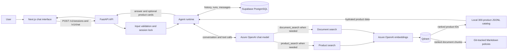

# Sales Bot

An AI-powered Azerbaijani e-commerce assistant that combines conversational product discovery, semantic search, structured product cards, and persistent chat history.

The project is implemented as a full-stack vertical slice: a Next.js chat interface communicates with a FastAPI agent runtime, Azure OpenAI handles conversation and embeddings, Qdrant retrieves relevant products, a validated local catalog supplies the final product data, and Supabase PostgreSQL stores sessions, messages, tool activity, and debug traces.

> The included catalog is deterministic synthetic data intended for development, testing, and evaluation. It contains realistic product names, but its commercial data and URLs are not production data.

## Highlights

- Azerbaijani-language conversational shopping experience
- AI-guided discovery across 300 products and six electronics categories
- Azure OpenAI chat completion and embedding deployments
- Qdrant-based semantic retrieval with exact identifier and payload filtering
- Optional Markdown document RAG for credit, delivery, warranty, return, and installation policies
- LLM-first semantic query plans for lookup, discovery, comparison, fallback, exclusion, and preferences
- Type-safe recursive filters for price, stock, brand, model, color, and category-specific specifications
- Explicit exact-match, matching-product, alternative, and not-found outcomes
- Full product hydration from a schema-validated local JSONL catalog
- Rich product-card responses in a responsive Next.js interface
- Persistent sessions and message history in Supabase PostgreSQL
- Development-only debug traces for model, tool, retrieval, and latency diagnostics
- Backend, frontend, acceptance, integration, and semantic-retrieval test coverage

## System Architecture



## Request Flow

1. The frontend creates a server-side chat session through `POST /v1/sessions`.
2. A user message is sent to `POST /v1/chat` with the session ID.
3. FastAPI validates and sanitizes the input, checks database readiness, and prevents concurrent runs in the same session.
4. The backend records the user message and agent run, then builds context from recent conversation history and product focus.
5. The Azure OpenAI chat model either answers directly or emits a typed `ProductQueryPlan` in the existing first `product_search` tool round. The plan separates entities, selection logic, hard filters, preferences, fact questions, comparison, and clarification.
6. The backend validates evidence against the current message, grounds fields against catalog metadata, resolves raw entities from prebuilt indexes, and compiles the language-independent expression tree to Qdrant filters. It does not parse Azerbaijani phrases with runtime word lists or regex meaning rules.
7. The selected IDs are hydrated from the local JSONL catalog so user-facing price, stock, rating, warranty, and specification data come from the canonical dataset.
8. Exact products are checked without filters first, so a constraint conflict cannot hide their existence. Fallback branches run in order, preferences affect ranking only, comparisons hydrate each entity separately, and alternatives exclude the requested product while retaining every hard predicate.
9. The agent produces an Azerbaijani answer and, when applicable, a structured product-card presentation.
10. The completed response, tool exchanges, metrics, and optional development trace are stored in PostgreSQL before the API returns the result to the frontend.

## Technology Stack

| Layer | Technology |
| --- | --- |
| Frontend | Next.js 16, React 19, TypeScript, Vitest, Testing Library |
| Backend API | FastAPI, Pydantic, Uvicorn |
| Agent and LLM | Azure OpenAI chat deployment with tool calling |
| Embeddings | Azure OpenAI embedding deployment |
| Vector search | Qdrant Cloud |
| Source catalog | Schema-validated JSONL dataset |
| Persistence | Supabase PostgreSQL, SQLAlchemy, Psycopg, Alembic |
| Quality | Pytest, Ruff, ESLint, Vitest, semantic retrieval evaluations |

## Product Dataset

The repository includes 300 deterministic synthetic products, split evenly across:

- Smartphones
- Tablets
- Laptops
- Air conditioners
- Televisions
- Headphones

The catalog uses Azerbaijani product content and AZN pricing. Its manifest records the dataset version, checksums, generation seed, category distribution, stock totals, and validation status. Qdrant stores searchable vectors and filter payloads; the JSONL catalog remains the source of truth for the complete product response.

## Prerequisites

- Python 3.14 or newer
- Node.js 20.9 or newer
- A Supabase PostgreSQL Session Pooler connection or compatible PostgreSQL database
- An Azure OpenAI resource with chat and embedding deployments
- A Qdrant Cloud cluster for semantic product search

Docker is not required for local development.

## Quick Start

The commands below are written for PowerShell on Windows.

### 1. Clone the repository

```powershell
git clone https://github.com/Mardaliyeva/sales-bot.git
cd sales-bot
```

### 2. Install backend dependencies

```powershell
python -m venv .venv
.\.venv\Scripts\Activate.ps1
python -m pip install --upgrade pip
python -m pip install -r requirements.lock
python -m pip install -e . --no-deps
Copy-Item .env.example .env
```

### 3. Configure the backend environment

Update `.env` with your own credentials and deployment names. Never place real credentials in `.env.example` or commit `.env` to Git.

| Variable | Purpose | Required |
| --- | --- | --- |
| `DATABASE_URL` | Supabase Session Pooler or PostgreSQL URL using `postgresql+psycopg://` | Yes |
| `CUSTOMER_AZURE_OPENAI_ENDPOINT` | Azure OpenAI HTTPS endpoint | Yes |
| `CUSTOMER_AZURE_OPENAI_API_KEY` | Azure OpenAI API key | Yes |
| `AZURE_TEXT_MODEL` | Azure chat deployment name | Yes |
| `AZURE_EMBEDDING_MODEL` | Azure embedding deployment name | Yes for search |
| `QDRANT_URL` | Qdrant Cloud HTTPS endpoint | Yes for search |
| `QDRANT_API_KEY` | Qdrant Cloud API key | Yes for search |
| `QDRANT_COLLECTION_NAME` | Product vector collection | Yes for search |
| `ENTITY_RESOLUTION_MIN_SCORE` | Strong semantic entity-candidate threshold | Optional |
| `ENTITY_RESOLUTION_MARGIN` | Minimum score gap required for a unique entity | Optional |
| `QDRANT_DOCUMENT_COLLECTION_NAME` | Separate Markdown document collection | For document search |
| `DOCUMENTS_PATH` | Git-tracked Markdown source directory | For document search |
| `DOCUMENT_SEARCH_ENABLED` | Advertises `document_search` only after index and baseline are ready | Optional |
| `TEST_DATABASE_URL` | Isolated PostgreSQL database used only by integration tests | Optional |
| `DEBUG_PANEL_ENABLED` | Enables the backend debug trace endpoint in development | Optional |

If the database password contains reserved URL characters, URL-encode it before placing it in `DATABASE_URL`.

### 4. Apply database migrations

```powershell
python -m alembic upgrade head
```

The migrations create tables for chat sessions, agent runs, messages, tool exchanges, usage metrics, and development debug traces.

### 5. Build the Qdrant product index

```powershell
python -m app.indexing.products index
python -m app.indexing.products status
```

To deliberately regenerate every embedding:

```powershell
python -m app.indexing.products index --refresh-embeddings
```

The backend checks collection compatibility at startup. If Azure embeddings or Qdrant are unavailable or the collection is not ready, semantic product search is disabled and returns an explicit unavailable result; there is no hidden lexical fallback.

### 5b. Build the optional Markdown document index

Place UTF-8 Markdown files in `data/documents/source`. Each filename must be a unique lowercase
document ID and each file must start with an H1 title. Then run:

```powershell
python -m app.indexing.documents index
python -m app.indexing.documents status
```

The command creates `sales_bot_documents_v1` in the existing Qdrant cluster, writes heading-aware
document chunks, removes stale chunks, and generates a deterministic `data/documents/manifest.json`.
Do not enable `DOCUMENT_SEARCH_ENABLED` until the document eval baseline described below exists.

### 6. Start the backend

```powershell
python -m uvicorn app.main:app --host 127.0.0.1 --port 8000 --reload
```

Useful backend URLs:

- API documentation: `http://127.0.0.1:8000/docs`
- Liveness check: `http://127.0.0.1:8000/health/live`
- Readiness check: `http://127.0.0.1:8000/health/ready`

### 7. Start the frontend

Open another PowerShell window:

```powershell
cd frontend
Copy-Item .env.example .env.local
npm.cmd install
npm.cmd run dev
```

Open `http://127.0.0.1:3000`. The frontend proxies `/backend/*` requests to the FastAPI URL configured through `SALES_BOT_API_URL`. Browser-side chat state is retained in `localStorage`, while authoritative session and agent history are stored by the backend in PostgreSQL.

## API Overview

### Create a session

```http
POST /v1/sessions
Content-Type: application/json

{}
```

Example response:

```json
{
  "session_id": "6dfbfa56-e61a-43f7-a1f0-932f94df27fd",
  "status": "active",
  "expires_at": "2026-08-14T12:00:00Z"
}
```

### Send a message

```http
POST /v1/chat
Content-Type: application/json

{
  "session_id": "6dfbfa56-e61a-43f7-a1f0-932f94df27fd",
  "message": "Show me a black 128 GB iPhone under 2,000 AZN"
}
```

The response contains the assistant answer, request and message identifiers, tools used, and an optional `presentation` object for product cards. The assistant itself responds in Azerbaijani.

### Health checks

| Endpoint | Description |
| --- | --- |
| `GET /health/live` | Confirms that the API process is running |
| `GET /health/ready` | Checks PostgreSQL migrations and local catalog readiness |

### Development debug trace

Set both of the following flags:

```env
# Backend .env
APP_ENV=development
DEBUG_PANEL_ENABLED=true

# Frontend .env.local
NEXT_PUBLIC_DEBUG_PANEL=true
```

The debug drawer exposes model stages, tool arguments, product and document Qdrant candidates,
selected Markdown chunks, JSON hydration, warnings, runtime metrics, and a deterministic
`decision_explanation`. That explanation is built from the validated semantic plan, catalog or
document evidence, runtime outcome, and session-memory transition; it is not model
chain-of-thought. Document filenames and chunk metadata remain developer-only and are not
included in normal chat responses. The endpoint is unavailable outside development mode and does
not expose API keys, the system prompt, provider reasoning details, raw vectors, or private
chain-of-thought reasoning. New traces use trace version `5`; the runtime reports API schema
version `2.5` through health metadata.

### Session memory

Successful runs keep a versioned, session-scoped memory object inside the existing
`chat_sessions.context` JSONB column. The memory stores at most three resolved entities, bounded
constraints and preferences, recent fact questions and display IDs, pending intent state, and
document source IDs. Version 2 stores two coordinated views: a deterministic Azerbaijani
`continuation_summary` for semantic continuity and a backend-verified `confirmed_state` plus full
canonical `pending_intent` for grounding. The summary is treated as data, never as an instruction,
and is replaced after each successful state-changing turn rather than accumulated. It never stores
full product payloads, assistant answers, prompts, raw tool
payloads, raw document chunks, vectors, or provider reasoning. The final message, debug trace, and
memory update are committed in one database transaction; failed runs preserve the previous
revision.

Memory writes and debug explanations are always enabled. Injection of that memory into the LLM
context is controlled separately by `SESSION_MEMORY_CONTEXT_ENABLED`. When the variable is not
set, injection defaults to `true` in development/test and `false` in production. Production must
enable it explicitly after the continuation acceptance suite passes. The serialized memory is
capped by `SESSION_MEMORY_MAX_BYTES` (default `8192`). Expired session context is removed lazily
and by the periodic `SESSION_CONTEXT_SCRUB_INTERVAL_SECONDS` job while debug audit rows retain their
normal retention behavior.

## Retrieval and Ranking

`product_search` accepts a recursive `ProductQueryPlan` rather than asking the model to flatten the sentence into independent filters. The plan supports `predicate`, `all_of`, `any_of`, `not`, `fallback`, `prefer`, and `entity_ref`; natural-language wording is interpreted by the LLM while these operators remain the backend execution contract. Fields exposed to the model are generated from loaded catalog metadata.

Entities are resolved after semantic parsing through normalized exact, token, and typo indexes. Exact product IDs and SKUs are verified directly. Multiple plausible products produce a clarification response with no cards. Session references can only use product IDs already supplied by the backend context. A bounded runtime cache stores semantic plans only; current price and stock are always fetched again.

Search behavior is intentionally explicit:

- Exact identifiers are checked against Qdrant payload fields.
- General queries use Azure embeddings over product name and description.
- Hard filters are applied in Qdrant rather than inferred after retrieval.
- Qdrant returns candidate IDs and ranking metadata.
- Full product objects are loaded from the local catalog.
- Price and rating sorting is applied to the retrieved candidate set.
- Alternative recommendations preserve hard constraints and report any relaxed fields.
- Semantic similarity alone is never presented as an exact match.

## Evaluation

The repository contains 30 canonical retrieval queries and 37 challenge queries, together with versioned baselines. Run the semantic evaluation with:

```powershell
python -m app.evals.product_semantic --update-baseline
python -m app.evals.product_semantic
```

The retrieval evaluation runner uses the Azure embedding deployment and Qdrant, but does not call the chat model or Supabase. Recalibrate `ALTERNATIVE_MIN_SCORE`, `ENTITY_RESOLUTION_MIN_SCORE`, and `ENTITY_RESOLUTION_MARGIN` whenever the dataset, embedding deployment, or embedding text format changes.

Run the live first-round semantic-plan gate separately (it calls only the configured chat deployment):

```powershell
python -m app.evals.semantic_plans
```

The human-reviewed cases are stored in `data/evals/semantic_query_plans.json`; the gate requires at least 95% exact semantic-signature accuracy.

After Markdown documents are added, create `data/evals/document_retrieval.json` with at least 30
manual cases and run:

```powershell
python -m app.evals.document_retrieval --update-baseline
python -m app.evals.document_retrieval
```

The generated `document_qdrant_v1.json` baseline binds the runtime score threshold to the exact
document checksum, collection name, embedding deployment, and dimensions. When document search is
enabled, missing or stale document index/baseline metadata makes `/health/ready` fail explicitly.

## Testing and Quality Checks

Backend checks:

```powershell
python -m ruff check .
python -m pytest -m "not integration"
python -m pytest -m integration
```

Frontend checks:

```powershell
cd frontend
npm.cmd test
npm.cmd run lint
npm.cmd run build
```

Unit and acceptance tests mock external Azure and Qdrant calls by default. Integration tests run only when `TEST_DATABASE_URL` is configured. Always use a dedicated database whose name ends with `_test`; never point destructive integration tests at the primary Supabase database.

## Project Structure

```text
sales-bot/
|-- app/
|   |-- agent/          # Agent loop, prompting, context, locking, presentation
|   |-- api/            # FastAPI routes, schemas, dependencies, error handling
|   |-- db/             # SQLAlchemy models, sessions, and repositories
|   |-- documents/      # Markdown loading, chunking, manifests, and baseline validation
|   |-- embeddings/     # Azure embedding client and local cache
|   |-- evals/          # Semantic retrieval evaluation runners
|   |-- indexing/       # Product and Markdown document indexing CLIs
|   |-- llm/            # Azure chat client and response schemas
|   |-- retrieval/      # Exact, filtered, semantic, and alternative retrieval
|   |-- safety/         # User-input validation
|   |-- tools/          # Typed product_search tool contract and registry
|   `-- vectorstores/   # Qdrant collection and point operations
|-- alembic/            # PostgreSQL schema migrations
|-- data/
|   |-- catalog/        # Products, schema, manifest, and golden queries
|   |-- documents/      # Git-tracked Markdown policy sources and generated manifest
|   `-- evals/          # Challenge cases and retrieval baselines
|-- frontend/           # Next.js chat interface and component tests
|-- tests/              # Backend unit, acceptance, and integration tests
|-- .env.example        # Safe backend configuration template
|-- pyproject.toml      # Python package and tooling configuration
`-- requirements.lock   # Reproducible Python dependency versions
```

## Current Scope

This repository is a production-oriented vertical slice, not a complete commerce platform. Markdown
document RAG is implemented but remains disabled until real policy documents are indexed and pass
their retrieval baseline. The current version does not include authentication, checkout, streaming
responses, operator handoff, OCR/PDF ingestion, or an administration interface. Product data is
synthetic and must be replaced or integrated with a real catalog before production use.
